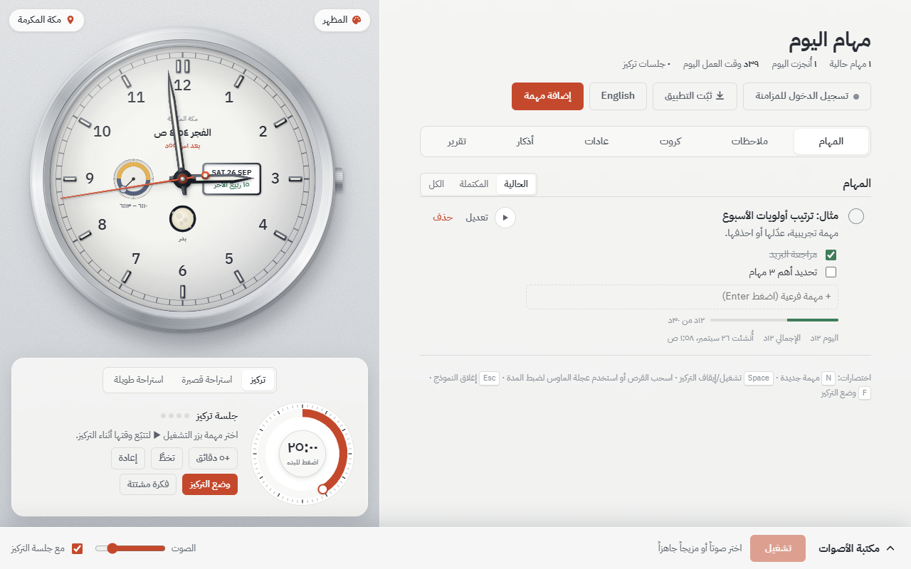

# Muslim To-Do List

**Plan your day around the prayers — tasks, focus timer, habits, adhkar and focus sounds, in Arabic and English.**

&nbsp;

&nbsp;

&nbsp;

**English:** a watch-face clock with prayer times, moon phase and the Hijri date; tasks split around the prayers; a Pomodoro focus mode; sticky notes, review cards, habits and adhkar; and a library of focus sounds. Works offline and syncs between devices. Open [the English version](https://micro4tricks-ai.github.io/muslim-todo-list/en/).

ساعة عقارب مع مواقيت الصلاة، وطور القمر، والشروق والغروب، والتاريخ الهجري والميلادي، ومؤقت تركيز، وقائمة مهام، ومكتبة أصوات للتركيز.

## التشغيل

- **على الإنترنت:** افتح رابط GitHub Pages الخاص بالمستودع.
- **على جهازك:** دبل كليك على `تشغيل.bat` (يشغّل سيرفر محلي صغير حتى تتكرر الأصوات بلا فاصل)، أو افتح `index.html` مباشرة.

## التثبيت على الموبايل والتابلت (مجاناً)

صفحة الخطوات لكل جهاز: [`install.html`](https://micro4tricks-ai.github.io/muslim-todo-list/install.html)

- **أندرويد:** ملف APK من [الموقع مباشرة](https://micro4tricks-ai.github.io/muslim-todo-list/muslim-todo-list.apk) (ونسخه في [صفحة الإصدارات](https://github.com/micro4tricks-ai/muslim-todo-list/releases/latest)) — تطبيق كامل تصل تنبيهات الصلاة فيه والتطبيق مغلق. أو «تثبيت التطبيق» من Chrome.
- **آيفون وآيباد:** من Safari ← مشاركة ← «إضافة إلى الشاشة الرئيسية».
- **الكمبيوتر:** زر «ثبّت التطبيق» أعلى قائمة المهام، أو أيقونة التثبيت في شريط العنوان.

الصفحة تعمل دون إنترنت بعد أول فتح (`sw.js`)، والأصوات التي شغّلتها مرة تُحفظ على الجهاز.

### إصدار نسخة أندرويد جديدة

1. عدّل ملفات الموقع كالعادة.
2. أنشئ وسم إصدار وارفعه: `git tag v1.0.1 && git push origin v1.0.1`
3. يبني GitHub Actions ملف APK موقّعاً وينشره في صفحة الإصدارات، ويجرّبه على محاكي أندرويد (الصور في نتيجة التشغيل).

مفتاح التوقيع محفوظ في أسرار المستودع، ونسخته الأصلية خارج المستودع. **لا تفقده:** كل تحديث يجب أن يُوقَّع بالمفتاح نفسه.

## الأقسام

- **المهام:** مهام فرعية، وقت متوقع، تتبّع الوقت، وتقسيم اليوم حسب أوقات الصلاة (بعد الفجر، بعد الظهر…).
- **ملاحظات لاصقة:** أوراق ملونة تُسحب لترتيبها وتُثبَّت، ويمكن تحويل أي ورقة إلى مهمة.
- **كروت المراجعة:** مجموعات سؤال وجواب بمراجعة متباعدة (نظام لايتنر) للحفظ والمذاكرة.
- **العادات والورد:** أذكار، ورد القرآن، استغفار، قيام، صيام… مع أيام متتالية وتقويم ١٢ أسبوعاً.
- **الأذكار والأدعية:** الصباح والمساء، بعد الصلاة، أدعية طالب العلم، التوفيق والتيسير، الهم وصفاء الذهن، الرقية الشرعية، النوم، الاستغفار؛ مع عدّاد وتلاوة صوتية ومسبحة.
- **التركيز:** مؤقت بومودورو، وضع تركيز بملء الشاشة، صندوق المشتتات، استراحات مفيدة (ذكر، حركة، ماء، تنفس)، وتنبيهات الصلاة.
- **التقرير:** دقائق التركيز اليومية والأسبوعية، أفضل وقت للتركيز، والأيام المتتالية.

### مصادر الأذكار
النصوص من **حصن المسلم** ([hisnmuslim.com](https://www.hisnmuslim.com)) والآيات من المصحف عبر [api.alquran.cloud](https://alquran.cloud) (quran-simple وترجمة Sahih International)، ويولّدها `tools/build_adhkar.py` إلى `js/adhkar-data.js` دون كتابة نصوص يدوياً، عدا أربعة أدعية مأثورة لطالب العلم مذكورة بمصادرها في السكربت.

## اللغة / Language

الصفحة بالعربي افتراضياً، وزر **English** أعلى قائمة المهام يحوّلها للإنجليزي (والاختيار يُحفظ).
رابط مباشر للنسخة الإنجليزية: `/en/` أو `?lang=en`.

The page opens in Arabic; the **English** button above the task list switches languages (and remembers the choice).
Direct English link: `/en/` or `?lang=en`.

## المزامنة بين الأجهزة (Supabase)

زر **مزامنة** يسجّل الدخول بالبريد الإلكتروني (رابط دخول بدون كلمة مرور) ويزامن المهام والإعدادات بين أجهزتك.
لتفعيلها مرة واحدة:

1. أنشئ مشروعاً مجانياً على [supabase.com](https://supabase.com).
2. **SQL Editor → New query**: الصق محتوى `supabase/schema.sql` واضغط **Run**.
3. **Authentication → URL Configuration**: اجعل *Site URL* رابط الموقع، وأضف إلى *Redirect URLs* رابط الموقع و`http://localhost:8765/`.
4. **Project Settings → API**: انسخ *Project URL* و*anon public key* إلى `js/config.js`.

ما يُزامَن: المهام (مع المهام الفرعية والوقت)، المدينة وطريقة الحساب، المظهر، اختيارات الأصوات، اللغة.
ما يبقى على كل جهاز: مؤقت التركيز، صورة الخلفية، مجلد الموسيقى.

## المحتويات

| المسار | الوصف |
|---|---|
| `index.html` | الصفحة والتصميم |
| `en/index.html` | رابط مباشر للنسخة الإنجليزية |
| `js/i18n.js` | الترجمة والتبديل بين العربي والإنجليزي |
| `js/clock.js` | رسم الساعة والعقارب والمينا |
| `js/astro.js` | الموقع، مواقيت الصلاة، القمر، التاريخ |
| `js/look.js` | ألوان المينا والإطار وخلفيات الصفحة |
| `js/sounds.js` | مكتبة الأصوات |
| `js/tasks.js` | المهام ومؤقت التركيز |
| `js/views.js` | تبويبات الأقسام وأدوات مشتركة |
| `js/notes.js` | الملاحظات اللاصقة |
| `js/cards.js` | كروت المراجعة |
| `js/habits.js` | العادات والورد |
| `js/adhkar.js`, `js/adhkar-data.js` | الأذكار والأدعية ونصوصها |
| `js/focus-plus.js` | صندوق المشتتات، سجل الجلسات، الاستراحات المفيدة |
| `js/focus-mode.js` | وضع التركيز بملء الشاشة |
| `js/prayer-alerts.js` | تنبيهات الصلاة |
| `js/report.js` | التقرير |
| `tools/build_adhkar.py` | توليد بيانات الأذكار من المصادر |
| `js/config.js` | إعدادات مشروع Supabase |
| `js/sync-core.js` | قواعد دمج البيانات بين الأجهزة |
| `js/sync.js` | تسجيل الدخول والمزامنة |
| `supabase/schema.sql` | جدول قاعدة البيانات وصلاحياته |
| `sounds/` | تسجيلات الأصوات |
| `manifest.webmanifest`, `icons/` | بيانات التطبيق القابل للتثبيت وأيقوناته |
| `sw.js` | العمل دون إنترنت |
| `install.html` | خطوات التثبيت لكل جهاز |
| `js/app.js` | زر التثبيت واختصارات الشاشة الرئيسية |
| `js/native.js` | إشعارات الصلاة والتركيز داخل تطبيق أندرويد |
| `js/vendor/supabase.js` | مكتبة Supabase (نسخة محلية، رخصة MIT) |
| `app/` | مشروع تطبيق أندرويد (Capacitor)، يأخذ ملفات الموقع كما هي |
| `.github/workflows/android.yml` | بناء ملف APK وتوقيعه ونشره وتجربته |

## المصادر والتراخيص

- **الأصوات:** من مشروع [Moodist](https://github.com/remvze/moodist)، مرخّصة تحت CC0 و[رخصة محتوى Pixabay](https://pixabay.com/service/license-summary/). إذا لم يوجد مجلد `sounds` تُحمَّل الملفات نفسها من jsDelivr.
- **مواقيت الصلاة:** حسابات مبنية على خوارزمية [PrayTimes.org](http://praytimes.org).
- **قائمة المهام:** مستوحاة من [to-do-list-project](https://github.com/nagesh882/to-do-list-project)، ومزايا التركيز وتتبّع الوقت من [Super Productivity](https://github.com/super-productivity/super-productivity).
