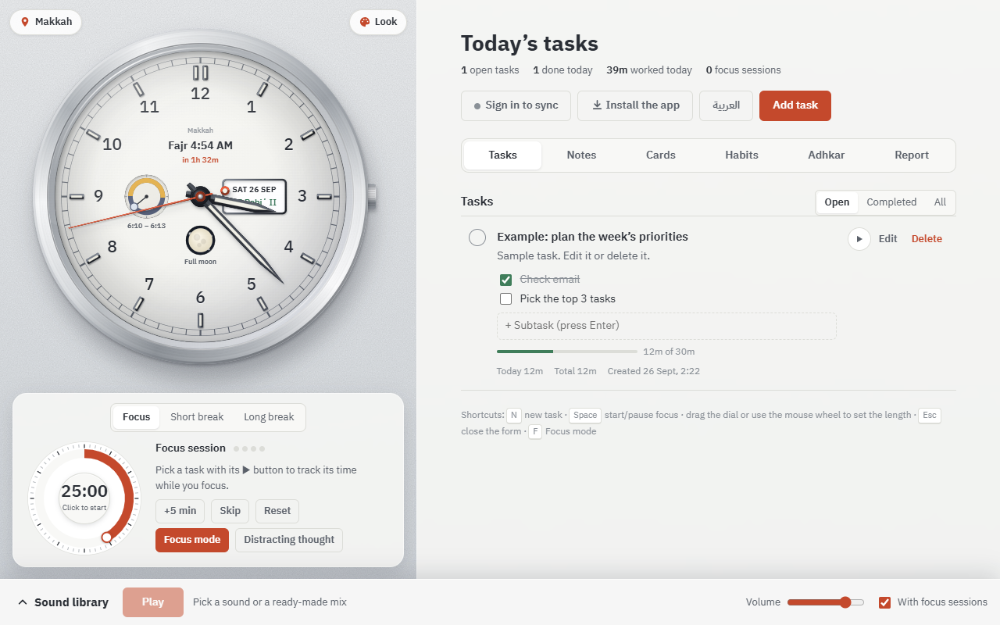

<div align="center">


# Muslim To-Do List

**Plan your day around the prayers — tasks, focus timer, habits, adhkar and focus sounds, in Arabic and English.**

[](https://micro4tricks-ai.github.io/muslim-todo-list/)
&nbsp;
[](https://github.com/micro4tricks-ai/muslim-todo-list/releases/latest)
&nbsp;

&nbsp;


[](https://github.com/micro4tricks-ai/muslim-todo-list/actions/workflows/android.yml)

[](https://github.com/micro4tricks-ai/muslim-todo-list/releases)

<a href="https://micro4tricks-ai.github.io/muslim-todo-list/"></a>

[**Open the app**](https://micro4tricks-ai.github.io/muslim-todo-list/) · [English version](https://micro4tricks-ai.github.io/muslim-todo-list/en/) · [Install on your phone](https://micro4tricks-ai.github.io/muslim-todo-list/install.html) · [Report a problem](https://github.com/micro4tricks-ai/muslim-todo-list/issues/new/choose)

</div>

---

## Contents

- [About](#about)
- [Features](#features)
- [Screenshots](#screenshots)
- [Install](#install)
- [Tech stack](#tech-stack)
- [Run locally](#run-locally)
- [Sync between devices (Supabase)](#sync-between-devices-supabase)
- [Android releases](#android-releases)
- [Project structure](#project-structure)
- [Contributing](#contributing)
- [Privacy](#privacy)
- [Sources and credits](#sources-and-credits)
- [License](#license)
- [بالعربي](#بالعربي)

## About

A calm daily planner built around the five prayers. The left side is a watch-face clock that shows the next prayer, sunrise and sunset, the moon phase and the Hijri and Gregorian dates. The right side is your day: tasks split around the prayers, sticky notes, review cards, habits, adhkar and a focus report. A Pomodoro timer and a library of focus sounds sit underneath.

It runs in any browser, installs as an app on phones, tablets and desktops, works offline after the first visit, and can sync between your devices. It opens in Arabic by default; one button switches everything to English.

## Features

| | Feature | Details |
|:-:|---|---|
| 🕰️ | **Prayer clock** | Watch-face clock with the next prayer and a countdown, sunrise/sunset, moon phase, Hijri + Gregorian date. 32 countries and 12 calculation methods (Egyptian Survey, Umm al-Qura, Dubai…). Custom dial, frame and background colours. |
| ✅ | **Tasks** | Subtasks, estimated time, time tracking, and the day split by prayer (after Fajr, after Dhuhr…). Keyboard shortcuts. |
| 🎯 | **Focus** | Pomodoro timer with a draggable dial, full-screen focus mode, a "distracting thought" box, useful breaks (dhikr, movement, water, breathing) and prayer alerts. |
| 🗒️ | **Sticky notes** | Coloured notes you drag to arrange and pin; turn any note into a task. |
| 🃏 | **Review cards** | Question-and-answer decks with spaced repetition (Leitner system) for memorising and studying. |
| 🔁 | **Habits and wird** | Adhkar, Quran reading, istighfar, qiyam, fasting… with streaks and a 12-week calendar. |
| 📿 | **Adhkar and duas** | Morning and evening, after prayer, for students, ease and success, worry and clarity, ruqyah, sleep and istighfar — with a counter, audio recitation and a tasbih. |
| 📊 | **Report** | Daily and weekly focus minutes, your best time to focus, and streaks. |
| 🎧 | **Focus sounds** | 32 recordings (rain, nature, places, noise, binaural…) that you mix, plus your own music folder from the device. |
| 🌐 | **Arabic ⇄ English** | Full RTL/LTR switch, remembered per device. Direct English link: `/en/` or `?lang=en`. |
| 🔄 | **Sync** | Passwordless email sign-in; tasks and settings sync across devices through Supabase. |
| 📱 | **Installable** | PWA on every platform, plus a free Android app with prayer notifications that arrive even when the app is closed. |

## Screenshots

<table>
  <tr>
    <td width="50%"><p align="center"><sub>Arabic (default)</sub></p></td>
    <td width="50%"><p align="center"><sub>English</sub></p></td>
  </tr>
</table>

## Install

Step-by-step page for every device: **[install.html](https://micro4tricks-ai.github.io/muslim-todo-list/install.html)**

| Device | How |
|---|---|
| **Android** | Download the [APK from the site](https://micro4tricks-ai.github.io/muslim-todo-list/muslim-todo-list.apk) (also on the [releases page](https://github.com/micro4tricks-ai/muslim-todo-list/releases/latest)). It is a full app, and prayer alerts arrive even when it is closed. Or use "Install app" in Chrome. |
| **iPhone / iPad** | In Safari: Share → "Add to Home Screen". |
| **Desktop** | The "Install the app" button above the task list, or the install icon in the address bar. |

After the first visit the app works offline (`sw.js`), and every sound you have played once is kept on the device.

## Tech stack

| Layer | Used |
|---|---|
| App | HTML5, CSS3 and vanilla JavaScript — no framework, no build step |
| Clock | Canvas 2D, with a lighter path on touch devices for smooth phone performance |
| Prayer times | Own implementation of the [PrayTimes.org](http://praytimes.org) algorithm |
| Offline / install | Service worker (`sw.js`) + Web App Manifest |
| Sync | [Supabase](https://supabase.com) (Postgres with row-level security, email magic-link auth) |
| Android | [Capacitor](https://capacitorjs.com) 8 with native local notifications |
| CI/CD | GitHub Actions: signed APK on every `v*` tag, emulator smoke test, GitHub Pages deploy |
| Data tools | Python script that builds the adhkar data from its sources |

## Run locally

```bash
git clone https://github.com/micro4tricks-ai/muslim-todo-list.git
cd muslim-todo-list
python -m http.server 8765      # then open http://localhost:8765
```

On Windows you can also double-click `تشغيل.bat`, which starts a small local server so the sounds loop without a gap. Opening `index.html` directly works too.

## Sync between devices (Supabase)

The **Sync** button signs in by email (a sign-in link, no password) and syncs your tasks and settings across devices. To set it up once on your own Supabase project:

1. Create a free project on [supabase.com](https://supabase.com).
2. **SQL Editor → New query:** paste `supabase/schema.sql` and press **Run**.
3. **Authentication → URL Configuration:** set *Site URL* to the site's address, and add the site and `http://localhost:8765/` to *Redirect URLs*.
4. **Project Settings → API:** copy the *Project URL* and the *anon public key* into `js/config.js`.

**Synced:** tasks (with subtasks and time), city and calculation method, appearance, sound choices, language.
**Kept per device:** the focus timer, the background image, the music folder.

## Android releases

1. Edit the site files as usual.
2. Create and push a version tag: `git tag v1.0.5 && git push origin v1.0.5`
3. GitHub Actions builds a signed APK, publishes it on the releases page, and tests it on an Android emulator (screenshots are in the run's results).

The signing key lives in the repository secrets, and its original copy is kept outside the repository. **Don't lose it:** every update must be signed with the same key, or phones will refuse to install it.

## Project structure

| Path | Description |
|---|---|
| `index.html` | The page and its styles |
| `en/index.html` | Direct link to the English version |
| `install.html` | Install steps for every device |
| `js/i18n.js` | Translation and the Arabic ⇄ English switch |
| `js/clock.js` | Drawing the clock, hands and dial |
| `js/astro.js` | Location, prayer times, moon and dates |
| `js/look.js` | Dial, frame and page background colours |
| `js/sounds.js` | Sound library |
| `js/tasks.js` | Tasks and the focus timer |
| `js/views.js` | Section tabs and shared helpers |
| `js/notes.js` | Sticky notes |
| `js/cards.js` | Review cards |
| `js/habits.js` | Habits and wird |
| `js/adhkar.js`, `js/adhkar-data.js` | Adhkar and duas, and their texts |
| `js/focus-plus.js` | Distraction box, session log, useful breaks |
| `js/focus-mode.js` | Full-screen focus mode |
| `js/prayer-alerts.js` | Prayer alerts |
| `js/report.js` | The report |
| `js/config.js` | Supabase project settings |
| `js/sync-core.js` | Rules for merging data between devices |
| `js/sync.js` | Sign-in and sync |
| `js/app.js` | Install button and home-screen shortcuts |
| `js/native.js` | Prayer and focus notifications inside the Android app |
| `js/vendor/supabase.js` | Supabase client (local copy, MIT license) |
| `supabase/schema.sql` | Database table and its access rules |
| `sounds/` | Sound recordings |
| `manifest.webmanifest`, `icons/` | Installable-app metadata and icons |
| `sw.js` | Offline support |
| `tools/build_adhkar.py` | Builds the adhkar data from its sources |
| `app/` | Android app project (Capacitor); it takes the site files as they are |
| `.github/workflows/android.yml` | Builds, signs, publishes and tests the APK |
| `docs/` | Logo, screenshots and social preview |

## Contributing

Bug reports and ideas are welcome.

1. [Open an issue](https://github.com/micro4tricks-ai/muslim-todo-list/issues/new/choose) and describe the device, browser and what happened.
2. For code changes: fork the repo, create a branch, run `node --check` on the scripts you changed, test in the browser, and open a pull request.
3. New interface text needs an English entry in `js/i18n.js`.
4. **Never type adhkar or Quran text by hand.** Regenerate `js/adhkar-data.js` with `python tools/build_adhkar.py`.

## Privacy

Without sync, everything stays in your browser's local storage and never leaves your device. If you turn on sync, your tasks and settings are stored in the project's Supabase database, protected by row-level security so each account can only read its own data. There are no ads and no analytics. Your music folder is played from your device and is never uploaded.

## Sources and credits

- **Adhkar:** texts from **Hisn al-Muslim** ([hisnmuslim.com](https://www.hisnmuslim.com)), and verses from the Mushaf through [api.alquran.cloud](https://alquran.cloud) (quran-simple and the Sahih International translation). `tools/build_adhkar.py` generates `js/adhkar-data.js` from them without any text typed by hand, except four well-known duas for students, cited with their sources in the script.
- **Sounds:** from the [Moodist](https://github.com/remvze/moodist) project, under CC0 and the [Pixabay Content License](https://pixabay.com/service/license-summary/). If the `sounds` folder is missing, the same files load from jsDelivr, pinned to one commit.
- **Prayer times:** calculations based on the [PrayTimes.org](http://praytimes.org) algorithm.
- **To-do list:** inspired by [to-do-list-project](https://github.com/nagesh882/to-do-list-project); the focus and time-tracking ideas come from [Super Productivity](https://github.com/super-productivity/super-productivity).

## License

The code is released under the [MIT License](LICENSE). Sounds, adhkar and Quran texts keep their original sources and licenses listed above.

---

## بالعربي

<div dir="rtl">

**قائمة مهام المسلم:** ساعة عقارب مع مواقيت الصلاة، وطور القمر، والشروق والغروب، والتاريخ الهجري والميلادي، ومؤقت تركيز، وقائمة مهام، ومكتبة أصوات للتركيز. الصفحة بالعربي افتراضياً، وزر **English** أعلى قائمة المهام يحوّلها للإنجليزي.

### الأقسام

- **المهام:** مهام فرعية، ووقت متوقع، وتتبّع الوقت، وتقسيم اليوم حسب أوقات الصلاة (بعد الفجر، بعد الظهر…).
- **ملاحظات لاصقة:** أوراق ملونة تُسحب لترتيبها وتُثبَّت، ويمكن تحويل أي ورقة إلى مهمة.
- **كروت المراجعة:** مجموعات سؤال وجواب بمراجعة متباعدة (نظام لايتنر) للحفظ والمذاكرة.
- **العادات والورد:** أذكار، وورد القرآن، واستغفار، وقيام، وصيام… مع أيام متتالية وتقويم ١٢ أسبوعاً.
- **الأذكار والأدعية:** الصباح والمساء، وبعد الصلاة، وأدعية طالب العلم، والتوفيق والتيسير، والهم وصفاء الذهن، والرقية الشرعية، والنوم، والاستغفار؛ مع عدّاد وتلاوة صوتية ومسبحة.
- **التركيز:** مؤقت بومودورو، ووضع تركيز بملء الشاشة، وصندوق المشتتات، واستراحات مفيدة (ذكر، حركة، ماء، تنفس)، وتنبيهات الصلاة.
- **التقرير:** دقائق التركيز اليومية والأسبوعية، وأفضل وقت للتركيز، والأيام المتتالية.

### التثبيت (مجاناً)

- **أندرويد:** ملف APK من [الموقع مباشرة](https://micro4tricks-ai.github.io/muslim-todo-list/muslim-todo-list.apk) — تطبيق كامل تصل تنبيهات الصلاة فيه والتطبيق مغلق.
- **آيفون وآيباد:** من Safari ← مشاركة ← «إضافة إلى الشاشة الرئيسية».
- **الكمبيوتر:** زر «ثبّت التطبيق» أعلى قائمة المهام.

خطوات كل جهاز بالتفصيل في [صفحة التثبيت](https://micro4tricks-ai.github.io/muslim-todo-list/install.html). الصفحة تعمل دون إنترنت بعد أول فتح.

### المزامنة

زر **مزامنة** يسجّل الدخول بالبريد الإلكتروني (رابط دخول بدون كلمة مرور) ويزامن المهام والإعدادات بين أجهزتك. خطوات تجهيز Supabase في قسم [Sync between devices](#sync-between-devices-supabase) أعلاه.

### المصادر

نصوص الأذكار من **حصن المسلم** والآيات من المصحف عبر api.alquran.cloud، تولَّد آلياً بالسكربت `tools/build_adhkar.py` دون كتابة يدوية. الأصوات من مشروع Moodist (CC0 ورخصة Pixabay).

</div>

---

<div align="center">

Designed and built by **Mahmoud Habashi · محمود حبشي** — [micro4tricks@gmail.com](mailto:micro4tricks@gmail.com)

If this helps you, ⭐ star the repo so more people can find it.

</div>
