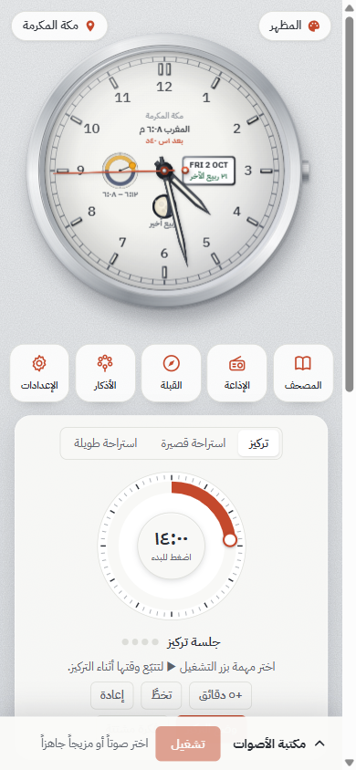
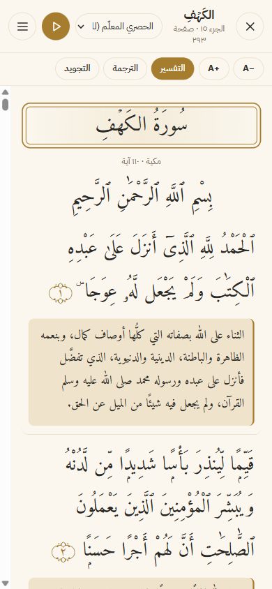
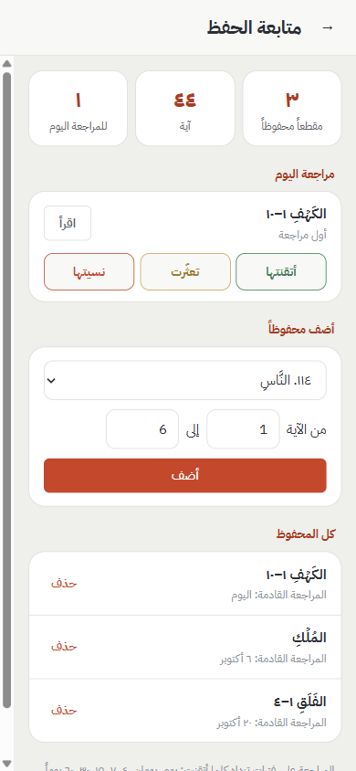
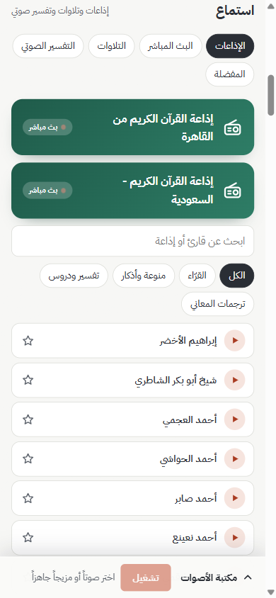
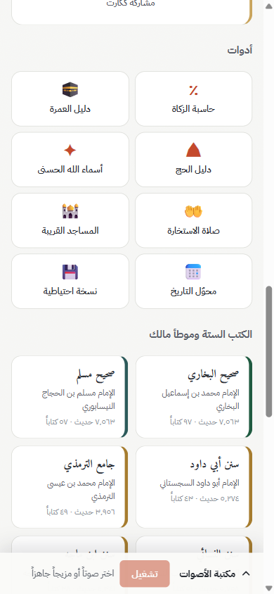
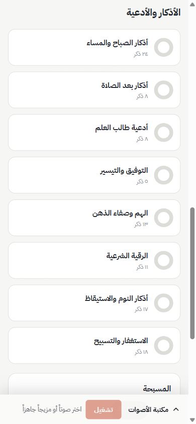
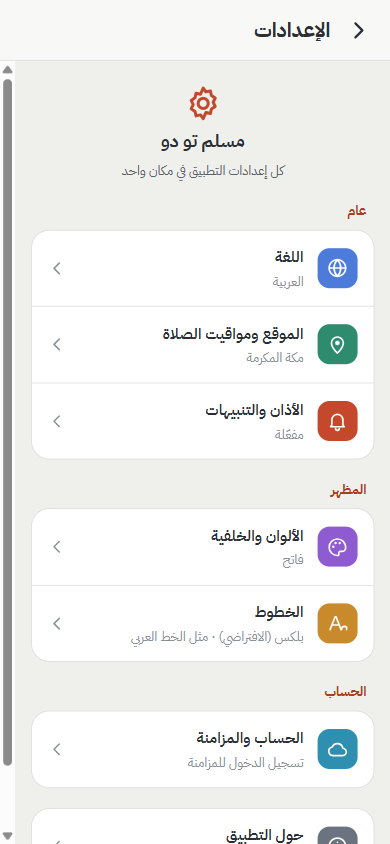
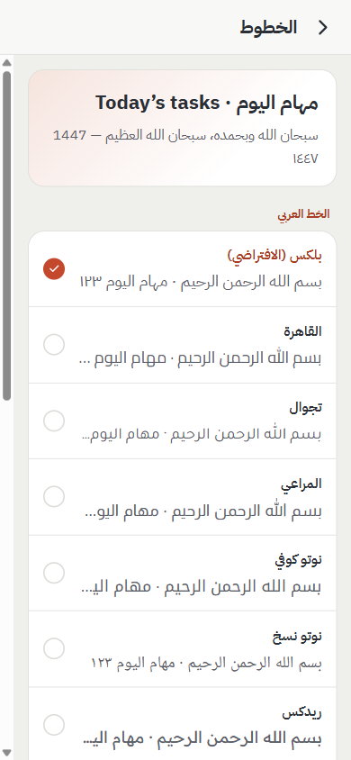
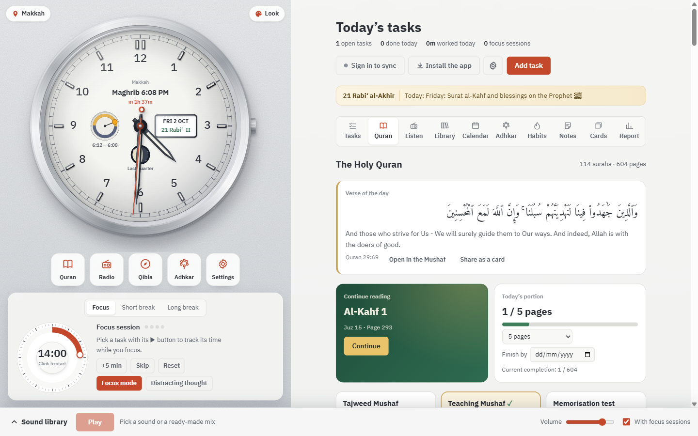

<div align="center">


# Muslim To-Do List · قائمة مهام المسلم

**Plan your day around the prayers — the Quran, hadith, Quran radio and live TV from Makkah and Madinah, adhkar, tasks and focus, in Arabic and English.**

**نظّم يومك حول الصلاة: المصحف، والحديث، وإذاعات القرآن، والبث المباشر من الحرمين، والأذكار، والمهام والتركيز.**

[](https://micro4tricks-ai.github.io/muslim-todo-list/)
&nbsp;
[](https://micro4tricks-ai.github.io/muslim-todo-list/muslim-todo-list.apk)
&nbsp;

&nbsp;


[](https://github.com/micro4tricks-ai/muslim-todo-list/actions/workflows/android.yml)
[](https://github.com/micro4tricks-ai/muslim-todo-list/actions/workflows/sources.yml)

[](https://github.com/micro4tricks-ai/muslim-todo-list/releases)

<a href="https://micro4tricks-ai.github.io/muslim-todo-list/"></a>

[**Open the app**](https://micro4tricks-ai.github.io/muslim-todo-list/) · [English version](https://micro4tricks-ai.github.io/muslim-todo-list/en/) · [**Download for Android**](https://micro4tricks-ai.github.io/muslim-todo-list/muslim-todo-list.apk) · [Install on any device](https://micro4tricks-ai.github.io/muslim-todo-list/install.html) · [Report a problem](https://github.com/micro4tricks-ai/muslim-todo-list/issues/new/choose) · [**بالعربي**](#بالعربي)

<br>

<table>
  <tr>
    <td align="center"><br><sub>My day · يومي</sub></td>
    <td align="center"><br><sub>The Mushaf · المصحف</sub></td>
    <td align="center"><br><sub>Memorisation · الحفظ</sub></td>
  </tr>
  <tr>
    <td align="center"><br><sub>Listen · استماع</sub></td>
    <td align="center"><br><sub>Library · المكتبة</sub></td>
    <td align="center"><br><sub>Adhkar · الأذكار</sub></td>
  </tr>
  <tr>
    <td align="center"><br><sub>Settings · الإعدادات</sub></td>
    <td align="center"><br><sub>Fonts · الخطوط</sub></td>
    <td align="center"><br><sub>English · الإنجليزية</sub></td>
  </tr>
</table>

</div>

---

## Contents

- [About](#about)
- [What's new in 2.x](#whats-new-in-2x)
- [What came in 1.7](#what-came-in-17)
- [Features](#features)
- [Install](#install)
- [Tech stack](#tech-stack)
- [Run locally](#run-locally)
- [Sync between devices (Supabase)](#sync-between-devices-supabase)
- [Releases and quality checks](#releases-and-quality-checks)
- [Project structure](#project-structure)
- [Contributing](#contributing)
- [Privacy](#privacy)
- [Sources and credits](#sources-and-credits)
- [License](#license)
- [بالعربي](#بالعربي)

## About

A calm daily companion built around the five prayers, made as an ongoing charity (*sadaqa jariya*): **free, with no ads and no tracking**. A watch-face clock shows the next prayer, sunrise and sunset, the moon and the Hijri and Gregorian dates. Around it: the full Mushaf with nine tafsirs, the six hadith books and more, Quran radio and live TV from the Two Holy Mosques, adhkar, a Hijri calendar with Sunnah fasting reminders, and a day of tasks, habits and focus sessions.

It runs in any browser, installs as an app on phones, tablets and computers, works offline after the first visit, and can sync between your devices. It opens in Arabic; one switch turns everything to English.

## What's new in 2.x

| | |
|---|---|
| 🏠 **My day and a bottom bar** | On phones the app opens on "My day": the next prayer, today's wird, the morning or evening adhkar and the memorisation review, each one tap away. A bottom bar (Home, Mushaf, Listen, Adhkar, More) replaces the long scroll. New users get a few welcome steps: language, place, adhan, font. |
| 🧠 **Memorisation reviews** | Add the surahs and passages you know by heart; each comes back for review on a growing schedule (1, 2, 4, 7, 15, 30, 60 days) — "well", "shaky" or "forgot" decides the next one. |
| 👥 **Group khatma** | Start a khatma, share its link, and family or friends each take a juz' until the 30 are done. Behind row-level security: only members see it. |
| ⏰ **The adhan on time on every phone** | A reliability card checks battery saving, notifications, exact alarms and the auto-start screens of Xiaomi, Oppo, Vivo, Huawei and others, and opens the right page for each. Shift any prayer by a few minutes to match your mosque. |
| ⬇️ **Listen offline** | Download surahs from any reciter and play them without the internet, with lock-screen controls. |
| 📲 **Widgets, shortcuts, Android Auto** | Home-screen widgets for the verse of the day and the tasbih (beside the prayer one), long-press shortcuts, and the radios and your downloads in the car through Android Auto. |
| 🔄 **Updates inside the app** | The app checks for a new version, downloads it and hands it to Android to install — only if it is signed with the same key. |
| 🪶 **A much smaller app** | 67 MB → 15 MB: the focus sounds now come from the site on first use and are kept on the phone. |
| 🔒 **Security** | A full review of the app and the site; a sign-in link sent by someone else no longer syncs your data to their account (2.1.1). Dependabot alerts and security updates are on. |

## What came in 1.7

| | |
|---|---|
| 📻 **Quran radio that keeps playing** | In the Android app the Listen tab plays through a native player (Media3 / ExoPlayer): it carries on with the screen off, shows the media notification and lock-screen controls, pauses for calls and the adhan and comes back after. Quran Radio from **Cairo** and from **Saudi Arabia** now play in the app. |
| 📺 **Live TV without ads** | The Quran channel from al-Masjid al-Haram and the Sunnah channel from the Prophet's Mosque. In the app it starts with the broadcaster's own stream (up to 1080p, no ads), then YouTube, then a lighter link — each one handing over to the next if it fails. |
| ⚙️ **A real Settings screen** | One screen, laid out like Android's: language, location and prayer times, adhan and alerts, colours, fonts, account, about. The phone's back key steps back through it. |
| 🔤 **Fonts** | 9 Arabic fonts (IBM Plex, Cairo, Tajawal, Almarai, Noto Kufi, Noto Naskh, Readex, El Messiri, Amiri) and 5 English ones, each with a live sample — kept with the app, so they work offline. |
| 📚 **More books** | Sunan ad-Darimi, Musnad Ahmad (the Rightly Guided Caliphs' part) and Shah Waliullah's Forty — 17 books in the library. |
| ↩️ **Back key** | Steps back (a book, a reciter, focus mode, Settings, the Mushaf) instead of closing the app; at the start it sends the app to the background, so the radio and the adhan carry on. |

## Features

| | Feature | Details |
|:-:|---|---|
| 🕰️ | **Prayer clock** | Watch-face clock with the next prayer and a countdown, sunrise/sunset, moon phase, Hijri + Gregorian date. 32 countries and 12 calculation methods (Egyptian Survey, Umm al-Qura, Dubai…). Custom dial, frame and background. |
| 📖 | **The Holy Quran** | The full Mushaf in the Uthmani script (Hafs, Tanzil text) with the Sahih International translation; verse-by-verse recitation from 9 reciters (including al-Husary's teaching recitation); a colour-coded tajweed Mushaf; a teaching mode (repeat each verse, pause to repeat after the reciter, slower speed) and a memorisation test; **9 tafsirs** (al-Muyassar, as-Sa‘di, Ibn Kathir, at-Tabari, al-Qurtubi, al-Baghawi, al-Wasit, al-Jalalayn, Ibn Kathir in English), shown under each verse if you like; word-by-word meanings with pronunciation; a completion plan; a daily wird; Juz ‘Amma for children; bookmarks, search, "continue reading", and light / sepia / night pages. Works offline once opened. |
| 📻 | **Listen** | Downloads to listen offline. **177 Quran radio stations** (reciters, mixed and adhkar, tafsir and lessons, translations of the meanings) plus Quran Radio from Cairo; **241 reciters** in every riwayah (Hafs, Warsh, Qalun, ad-Duri…), whole surahs one after another; **audio tafsir** (at-Tabari's summary, by surah and verses); favourites, "continue listening" from the same minute, and a sleep timer. |
| 📺 | **Live TV** | Live from al-Masjid al-Haram and the Prophet's Mosque — the official broadcast of the Quran and Sunnah channels, in the app without ads. |
| 📅 | **Hijri calendar and Sunnah reminders** | Umm al-Qura month view with a day shift for local moon sighting; reminders for Monday and Thursday fasts, the White Days, Arafah, Ashura, six of Shawwal, Ramadan and its last ten nights, and the ten days of Dhul-Hijjah, each with its hadith, reference and grading; no-fasting days marked; Friday and adhkar reminders. |
| 📚 | **Library** | The six hadith books and al-Muwatta (Arabic with English and the gradings of al-Albani, Shu‘ayb al-Arna’ut, Ahmad Shakir and others; a "sahih and hasan only" filter), plus Sunan ad-Darimi, Musnad Ahmad (the Caliphs' part), an-Nawawi's Forty, the Forty Qudsi, Shah Waliullah's Forty, Riyad as-Salihin, Bulugh al-Maram, al-Adab al-Mufrad, ash-Shama’il and Mishkat al-Masabih. Search, hadith numbers, saved hadiths; chapters stay offline once read. |
| 🕌 | **The Prophet's prayer ﷺ** | The prayer from the takbir to the taslim in the order of al-Albani's *Sifat Salat an-Nabi*, each step with its authentic hadith (the book itself is linked on al-Maktaba al-Shamela, not copied). |
| 🕋 | **My prayers** | Log each prayer (in congregation, on time, late, missed), the sunnah rak‘ahs, witr, duha and qiyam; a week at a glance and a count of prayers to make up. |
| 🌙 | **Ramadan** | Imsak and iftar countdowns, the iftar and Laylat al-Qadr supplications, a fasting tracker, a shareable imsakiya and a suhoor reminder. |
| 🧰 | **Tools** | Zakat calculator, Umrah and Hajj guides with their hadiths, the 99 Names, istikhara, nearby mosques (OpenStreetMap), Hijri ⇄ Gregorian converter, and a backup file. |
| 🧭 | **Qibla** | Direction and distance to the Kaaba, with a live compass on phones. |
| 📿 | **Adhkar and duas** | Morning and evening, after prayer, for students, ease, worry, ruqyah, sleep and istighfar — with a counter, audio and a tasbih. |
| 🔔 | **Adhan and alerts** | Four adhan recordings plus a separate Fajr adhan, played by the phone's alarm clock even when the app is closed (and, if you wish, on silent mode); an iqamah reminder; reminders as designed cards you can share. |
| 📲 | **Widgets and shortcuts** | The next prayer with a live countdown, the verse of the day, a tasbih; long-press shortcuts; Android Auto. |
| 🧠 | **Memorisation** | What you know by heart, with spaced reviews on "My day". |
| 👥 | **Group khatma** | Share a khatma and split the 30 juz' between family and friends. |
| ✅ | **Tasks and focus** | Tasks with subtasks and time tracking, the day split by prayer; a Pomodoro timer, full-screen focus mode, useful breaks, sticky notes, review cards with spaced repetition, habits with streaks, and a report with charts. |
| 🎧 | **Focus sounds** | 32 recordings (rain, nature, places, noise…) to mix, plus your own music folder; fetched once and kept on the phone. |
| ⚙️ | **Settings, fonts, dark mode** | One Settings screen; 9 Arabic and 5 English interface fonts; light, dark or following the device; four text sizes. |
| 🌐 | **Arabic ⇄ English** | Full RTL/LTR switch. Direct English link: `/en/` or `?lang=en`. |
| 🔄 | **Sync** | Email and password sign-in; tasks and settings sync across devices through Supabase. |

## Install

Step-by-step page for every device: **[install.html](https://micro4tricks-ai.github.io/muslim-todo-list/install.html)**

| Device | How |
|---|---|
| **Android** | Download the [APK from the site](https://micro4tricks-ai.github.io/muslim-todo-list/muslim-todo-list.apk) (also on the [releases page](https://github.com/micro4tricks-ai/muslim-todo-list/releases/latest)). Updates arrive inside the app (Settings → About). |
| **iPhone / iPad** | In Safari: Share → "Add to Home Screen". |
| **Computer** | The "Install the app" button above the task list, or the install icon in the address bar. |

After the first visit the app works offline (`sw.js`); the radio, live TV and recitations need the internet.

## Tech stack

| Layer | Used |
|---|---|
| App | HTML5, CSS3 and vanilla JavaScript — no framework, no build step |
| Clock | Canvas 2D, with a lighter path on touch devices |
| Prayer times | Own implementation of the [PrayTimes.org](http://praytimes.org) algorithm |
| Offline / install | Service worker (`sw.js`) + Web App Manifest |
| Sync | [Supabase](https://supabase.com) (Postgres with row-level security) |
| Android | [Capacitor](https://capacitorjs.com) 8; native Java for the adhan (alarm clock + foreground service), the widget, the back key and the Listen player ([Media3 ExoPlayer](https://developer.android.com/media/media3) with a media session) |
| Live TV | [hls.js](https://github.com/video-dev/hls.js) (local copy) and the YouTube IFrame API |
| CI/CD | GitHub Actions: signed APK on every `v*` tag, a full test on an Android emulator before the release is published, GitHub Pages deploy, and a daily check of every outside source |
| Data tools | Python and Node scripts that build the adhkar, Mushaf, hadith and font data from their sources, so no religious text is typed by hand |

## Run locally

```bash
git clone https://github.com/micro4tricks-ai/muslim-todo-list.git
cd muslim-todo-list
python -m http.server 8765      # then open http://localhost:8765
```

On Windows you can also double-click `تشغيل.bat`.

## Sync between devices (Supabase)

The account (Settings → Account & sync) signs in with an email and password and syncs tasks and settings. To set it up on your own Supabase project:

1. Create a free project on [supabase.com](https://supabase.com).
2. **SQL Editor:** run `supabase/schema.sql`, then `supabase/khatma.sql` for the group khatma.
3. **Authentication → URL Configuration:** set the *Site URL* and add the site and `http://localhost:8765/` to *Redirect URLs*.
4. **Project Settings → API:** copy the *Project URL* and the *anon public key* into `js/config.js`.

## Releases and quality checks

1. Push a version tag: `git tag v2.1.2 && git push origin v2.1.2`.
2. GitHub Actions builds a signed APK, installs the debug build on an **Android emulator** and goes through the app like a person would: every tab, the Mushaf, the library, both Quran radios on the native player, live TV, every Settings page, a font change, the back key, the adhan, the widget, and a renderer crash it must recover from. It measures memory and freezes, and **the release is published only if nothing is wrong**.
3. The site is redeployed with the new APK next to it and `version.json`, which the app reads to offer the update.
4. Optionally, [`devices.yml`](.github/workflows/devices.yml) runs the release on real Samsung and Xiaomi phones in Firebase Test Lab.

Every day, [`sources.yml`](.github/workflows/sources.yml) checks every outside service the app reads from (radio, TV, recitations, tafsir, hadith, adhkar audio) and turns red when one is down. Live links live in [`live.json`](live.json) on the site, so a dead link is fixed there **without an app update**.

The signing key lives in the repository secrets, and its original copy is kept outside the repository: every update must be signed with the same key.

## Project structure

| Path | Description |
|---|---|
| `index.html`, `en/`, `install.html` | The page and its styles, the English link, install steps |
| `js/i18n.js` | Translation and the Arabic ⇄ English switch |
| `js/clock.js`, `js/astro.js` | The clock; location, prayer times, moon and dates |
| `js/look.js`, `fonts/` | Colours, backgrounds, text size and the interface fonts (`fonts/extra.css` from `tools/build_fonts.py`) |
| `js/settings.js`, `js/device.js` | The Settings screen; the adhan reliability card |
| `js/nav.js`, `js/today.js` | The bottom bar and "My day" |
| `js/hifz.js`, `js/khatma.js`, `supabase/khatma.sql` | Memorisation reviews; the group khatma and its row-level security |
| `js/views.js` | Tabs, shared helpers and the back-key handler |
| `js/quran.js`, `js/quran-meta.js`, `quran/` | The Mushaf reader and its texts |
| `js/listen.js`, `live.json`, `tv.html`, `js/vendor/hls.light.min.js` | Radio, recitations, audio tafsir and live TV |
| `js/library.js`, `js/library-meta.js`, `js/salah-data.js` | The hadith library and the Prophet's prayer |
| `js/sunnah.js`, `js/sunnah-data.js` | Hijri calendar and Sunnah reminders |
| `js/adhkar.js`, `js/adhkar-data.js` | Adhkar and duas |
| `js/prayers.js`, `js/prayer-alerts.js`, `js/native.js` | My prayers, prayer alerts, and the Android notifications and adhan |
| `js/tasks.js`, `js/notes.js`, `js/cards.js`, `js/habits.js`, `js/focus-*.js`, `js/report.js`, `js/sounds.js` | Tasks, notes, review cards, habits, focus, report, sounds |
| `js/tools.js`, `js/qibla.js`, `js/remind-card.js` | Tools, Qibla, reminder cards |
| `js/sync*.js`, `js/config.js`, `supabase/schema.sql` | Sync |
| `app/` | The Android app (Capacitor); Java in `app/android/app/src/main/java/…/muslimtodo/` (`PlayerService`, `PlayerPlugin`, `DevicePlugin`, `Adhan*`, `*Widget`, `MainActivity`) |
| `app/scripts/smoke.mjs` | The emulator test |
| `tools/build_*.py` | Build the Quran, adhkar, hadith, salah, extras and font data from their sources |
| `tools/check_sources.mjs`, `tools/refresh_live.mjs` | The daily sources check and the live-video refresher |
| `tools/supabase_migrate.py`, `tools/test_khatma.py` | Apply the SQL and test the khatma rules (in a transaction that is rolled back) |
| `.github/workflows/` | `android.yml` (build, test, release), `pages.yml` (site), `sources.yml` (daily check), `devices.yml` (real phones, see [docs/DEVICE_TESTING.md](docs/DEVICE_TESTING.md)) |
| `fastlane/metadata/android/`, `docs/PUBLISHING.md` | Store texts and how to list the app in other stores |

## Contributing

Bug reports and ideas are welcome: [open an issue](https://github.com/micro4tricks-ai/muslim-todo-list/issues/new/choose) with the device and what happened. For code: fork, branch, run `node --check` on the scripts you changed, test in the browser, open a pull request. New interface text needs an English entry in `js/i18n.js`. **Never type Quran, hadith or adhkar text by hand** — regenerate it with the scripts in `tools/`.

## Privacy

Without sync, everything stays on your device. With sync, tasks and settings are stored in the project's Supabase database behind row-level security, so each account reads only its own data. **No ads, no analytics, no tracking.** Your music folder is played from your device and never uploaded.

## Sources and credits

- **Quran:** Tanzil text through [api.alquran.cloud](https://alquran.cloud); recitations from [cdn.islamic.network](https://islamic.network) and [everyayah.com](https://everyayah.com); word by word from [quran.com](https://quran.com); tafsirs from [spa5k/tafsir_api](https://github.com/spa5k/tafsir_api) and alquran.cloud.
- **Hadith:** [fawazahmed0/hadith-api](https://github.com/fawazahmed0/hadith-api) and [AhmedBaset/hadith-json](https://github.com/AhmedBaset/hadith-json).
- **Radio, recitations and audio tafsir:** [mp3quran.net](https://www.mp3quran.net) (its open API); Quran Radio from Cairo through radiojar.
- **Live TV:** the Quran and Sunnah channels of the Saudi Broadcasting Authority — their own platform [Aloula](https://aloula.sba.sa), their official YouTube channels, and Globecast.
- **Adhkar:** [Hisn al-Muslim](https://www.hisnmuslim.com). **Adhan recordings:** Wikimedia Commons (see `sounds/adhan/CREDITS.md`).
- **Fonts:** IBM Plex Sans Arabic, Amiri, Cairo, Tajawal, Almarai, Noto Kufi/Naskh Arabic, Readex Pro, El Messiri, Inter, Roboto, Nunito, Lato and Poppins — SIL Open Font License, from Google Fonts.
- **Libraries:** Capacitor, Media3 (Apache 2.0), hls.js (Apache 2.0), Supabase JS (MIT).
- **Sounds:** [Moodist](https://github.com/remvze/moodist) (CC0 and the Pixabay licence). **Prayer times:** the [PrayTimes.org](http://praytimes.org) algorithm.

## License

The code is released under the [MIT License](LICENSE). Texts, recordings, broadcasts and fonts keep their own sources and licences listed above.

---

## بالعربي

<div dir="rtl">

**قائمة مهام المسلم** رفيق يومي هادئ مبني حول الصلوات الخمس، معمول **صدقة جارية: مجاني بالكامل، بلا إعلانات وبلا تتبّع**. ساعة عقارب تعرض الصلاة القادمة، والشروق والغروب، والقمر، والتاريخ الهجري والميلادي، وحولها كل ما يحتاجه المسلم في يومه.

### الجديد في الإصدار ٢

- **«يومي» وشريط سفلي:** على الموبايل يفتح التطبيق على الصلاة القادمة، وورد اليوم، والأذكار، ومراجعة الحفظ؛ وشريط سفلي للتنقل (الرئيسية، المصحف، استماع، الأذكار، المزيد)، وخطوات ترحيب للمستخدم الجديد.
- **متابعة الحفظ:** أضف ما تحفظه، ويرجع لك للمراجعة على فترات تزداد كلما أتقنت (يوم، يومان، ٤، ٧، ١٥، ٣٠، ٦٠ يوماً).
- **ختمة جماعية:** ابدأ ختمة وشارك رابطها، وكل واحد من الأهل والأصحاب يأخذ جزءاً حتى تكتمل الثلاثون.
- **الأذان في وقته على كل الهواتف:** بطاقة تفحص توفير البطارية والإشعارات والمنبّهات الدقيقة والتشغيل التلقائي في شاومي وأوبو وفيفو وهواوي وغيرها، وتعديل كل صلاة بدقائق لتوافق مسجدك.
- **الاستماع دون إنترنت:** نزّل السور من أي قارئ واسمعها بلا إنترنت.
- **ويدجت وأيقونات مختصرة وAndroid Auto:** آية اليوم، والمسبحة، والإذاعات والتنزيلات في السيارة.
- **التحديث من داخل التطبيق،** وحجم أصغر بكثير (من ٦٧ إلى ١٥ ميجا).
- **الأمان:** فحص كامل للتطبيق والموقع، وإغلاق ثغرة رابط الدخول المرسَل من شخص آخر (٢٫١٫١).

### ما جاء في الإصدار ١٫٧

- **إذاعات القرآن تعمل والشاشة مقفولة:** في تطبيق أندرويد صار الاستماع بمشغّل أندرويد أصلي، مع التحكم من الإشعارات وشاشة القفل، ويقف وقت المكالمات والأذان ويرجع بعدها. وإذاعة القرآن الكريم من **القاهرة** ومن **السعودية** تعملان الآن.
- **البث المباشر بلا إعلانات:** قناة القرآن الكريم من المسجد الحرام وقناة السنة النبوية من المسجد النبوي، من البث الرسمي للهيئة بجودة حتى 1080p، ولو تعطّل يتحوّل وحده لمصدر آخر.
- **صفحة إعدادات مثل تطبيقات أندرويد:** اللغة، والموقع والمواقيت، والأذان والتنبيهات، والألوان، والخطوط، والحساب، وحول التطبيق.
- **الخطوط:** ٩ خطوط عربية (بلكس، القاهرة، تجوال، المراعي، نوتو كوفي، نوتو نسخ، ريدكس، المسيري، أميري) و٥ إنجليزية، مع معاينة حيّة، وتعمل دون إنترنت.
- **كتب جديدة:** سنن الدارمي، ومسند الإمام أحمد (مسانيد الخلفاء الراشدين)، والأربعون لولي الله الدهلوي — ١٧ كتاباً في المكتبة.
- **زر الرجوع:** يرجع خطوة بدل إغلاق التطبيق.

### الأقسام

- **المصحف الشريف:** الرسم العثماني، و٩ تفاسير معتمدة تظهر تحت كل آية إن شئت، والتلاوة آية بآية لـ٩ قرّاء، ومصحف التجويد الملوّن، والمصحف المعلّم، واختبار الحفظ، ومعاني الكلمات، وخطة الختمة والورد اليومي.
- **استماع:** ١٧٧ إذاعة، و٢٤١ قارئاً بكل الروايات، والتفسير الصوتي، والبث المباشر من الحرمين، والمفضلة، ومؤقت النوم.
- **المكتبة:** الكتب الستة والموطأ بأحكام الألباني والأرناؤوط وغيرهما، ورياض الصالحين، وبلوغ المرام، والأدب المفرد، والشمائل، والمشكاة، والأربعينات، والدارمي، ومسند أحمد؛ وصفة صلاة النبي ﷺ على ترتيب كتاب الألباني بأدلتها.
- **التقويم الهجري وتنبيهات السنن:** صيام الاثنين والخميس والأيام البيض وعرفة وعاشوراء والست من شوال، ورمضان والعشر، بالدليل والتخريج.
- **صلواتي ورمضان والأدوات:** سجل الصلوات والسنن والقضاء، والإمساكية، وحاسبة الزكاة، ودليل الحج والعمرة، والأسماء الحسنى، والاستخارة، والمساجد القريبة، ومحوّل التاريخ، والقبلة.
- **الأذكار والأدعية:** الصباح والمساء وبعد الصلاة وغيرها، مع العدّاد والتلاوة الصوتية والمسبحة.
- **الأذان والتنبيهات:** أربعة أصوات أذان وأذان مستقل للفجر، يعمل والتطبيق مغلق، وتذكير الإقامة، وكروت تذكير تُشارَك صوراً، وويدجت للصلاة وآية اليوم والمسبحة.
- **المهام والتركيز:** مهام فرعية وتتبع الوقت وتقسيم اليوم حسب الصلاة، ومؤقت تركيز، وملاحظات، وكروت مراجعة، وعادات، وتقرير، ومكتبة أصوات للتركيز.

### التثبيت (مجاناً)

- **أندرويد:** [حمّل التطبيق من الموقع مباشرة](https://micro4tricks-ai.github.io/muslim-todo-list/muslim-todo-list.apk). والتحديثات تصلك من داخل التطبيق (الإعدادات ← حول التطبيق).
- **آيفون وآيباد:** من Safari ← مشاركة ← «إضافة إلى الشاشة الرئيسية».
- **الكمبيوتر:** زر «ثبّت التطبيق» أعلى قائمة المهام.

### الجودة والأمان

كل إصدار يُجرَّب آلياً على محاكي أندرويد قبل نشره (كل الأقسام، والإذاعات، والبث، والإعدادات، وزر الرجوع، والأذان، والويدجت)، ولا يُنشر إلا إذا لم تظهر أي مشكلة. وكل يوم يُفحص كل مصدر خارجي يعتمد عليه التطبيق، وروابط البث في ملف `live.json` على الموقع تُصلَح دون تحديث التطبيق. لا تُكتب نصوص القرآن والحديث والأذكار يدوياً أبداً، بل تُولَّد آلياً من مصادرها.

</div>

---

<div align="center">

Designed and built by **Mahmoud Habashi · محمود حبشي** — [micro4tricks@gmail.com](mailto:micro4tricks@gmail.com)

If this helps you, ⭐ star the repo so more people can find it — وإن نفعك فادعُ لنا.

</div>
